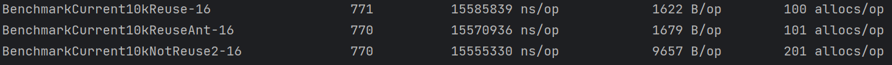
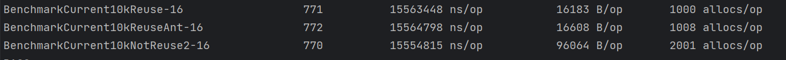
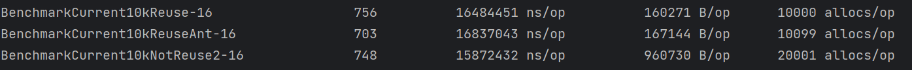

# go-threading
号称比net/http标准库快10倍的fasthttp https://github.com/valyala/fasthttp ,参考其资源复用模型开发的go协程池，可控制任务并发以及减少大量内存分配，减少gc压力。
# 安装
> go get github.com/linzedo/go-threading

# 使用方法
```go
    //项目启动前可手动开启协程池，修改默认参数
    StartPool(SetMaxIdleWorkerDuration(time.Second*30), SetMinWorkCount(100))
    gs := New(Config{
		GoCount: c, //本次要开启的任务数
		Wait:    true, //出错或panic是否进行同步等待 
	})
	for j := 0; j < c; j++ {
		_ = gs.Go(func() error {
			... //逻辑擦欧总
			if err!=nil{
			    gs.Err(err)//手动记录错误	
            }   
			return nil
		})
	}
	err = gs.Wait()
```
# 基准测试
以下分别是本项目协程池、ant协程池、以及未使用协程池在每次开启10、100、1000、10000个任务持续10秒的基准测试。
<br>
&emsp;_**任务内容**_
- 一次原子操作
- 10ms耗时操作
- 10000次循环自增

>10次并发任务

>100次并发任务

>1000次并发任务

>10000次并发任务
 
总结：开启协程池比不开启协程池可以节省5倍以上的内存开销，同时效率也比ant协程池要略好
